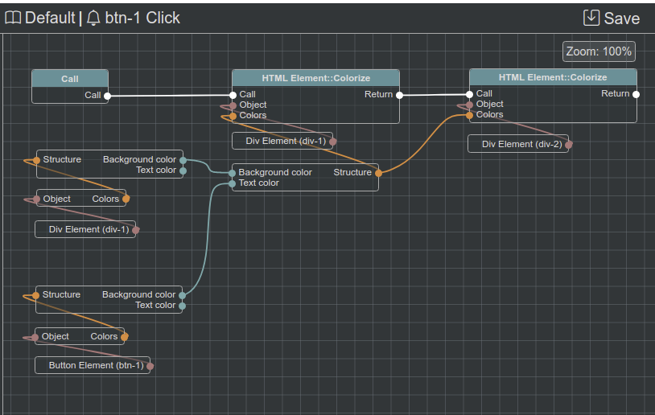
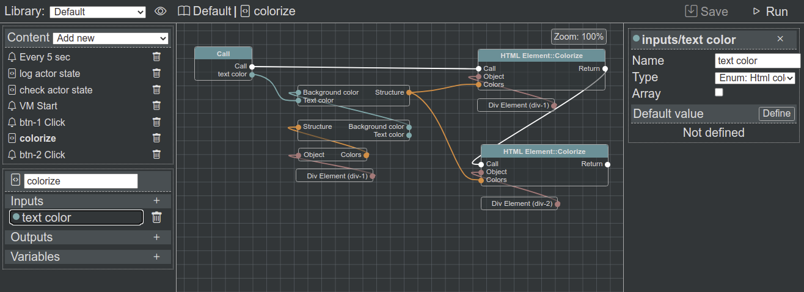
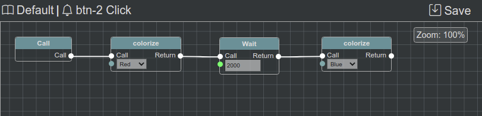

Extended Integration
====================

This example will demonstrate how to integrate **@bluepjs** more deep: example will control 2 divs and 2 buttons background and text colors and buttons ``click`` event:

To make example more "demonstratable" new **Module** will be created with special types defenitions (enums, structs, classes) and **Actors** will demonstrate **OOP Inheritance**.

HTML structure for demo is simple:

.. literalinclude:: ../../../source/example/src/views/About.vue
   :language: html
   :lines: 74-79

css:

.. literalinclude:: ../../../source/example/src/views/About.vue
   :language: css
   :lines: 90-99

Module
------

Let's see all file first, and describe it by parts after:

.. literalinclude:: ../../../source/example/src/vm/page.module.js
   :caption: example/src/vm/page.module.js
   :language: javascript
   :linenos:

**Module** defines:

 * **enum** ``html/color`` with pairs of ``cssColor`` - ``Color name``. Full type code is ``bluep/enum/html/color``
 * **struct** ``element/colors`` with fileds ``background`` and ``text``. Full type code is ``bluep/struct/element/colors``
 * special color for **struct**
 * class ``html/element`` describes parent class of module actors. Because parent class is never directly used by **Vm** - it's metadata can't be directly accessible (from class metadata) and provided in module metadata.

 Because of not really nice demo architecture (IDE using "backend Vm", and demo module runs only on frontent) - module initialization is "tricky" and we initialize "empty" actors just to get module/actors information for **IDE**

.. literalinclude:: ../../../source/example/server.js
   :language: javascript
   :lines: 16-18

But on frontend module initialized with real DOM elements:

.. literalinclude:: ../../../source/example/src/views/About.vue
   :language: javascript
   :lines: 4,51,54

.. note::

   ``$refs`` is part of Vue 3 framework.

Actors
------

html/element
~~~~~~~~~~~~

Base class for actors in this demo named "HTML Element" (with code "html/element").

.. literalinclude:: ../../../source/example/src/vm/element.actor.js
   :caption: example/src/vm/element.actor.js
   :language: javascript
   :linenos:

Take attention to ``_state`` defenition (line 19). State described at **Module** metadata as variable with code ``colors`` typeof ``bluep/struct/element/colors``.

.. literalinclude:: ../../../source/example/src/vm/page.module.js
   :language: javascript
   :lines: 64-72

Struct ``element/colors`` described having 2 fileds type of ``bluep/enum/html/color``:

.. literalinclude:: ../../../source/example/src/vm/page.module.js
   :language: javascript
   :lines: 33-49

And enum type ``html/color`` described with next values:

.. literalinclude:: ../../../source/example/src/vm/page.module.js
   :language: javascript
   :lines: 18-29

As result state definition is:

.. literalinclude:: ../../../source/example/src/vm/element.actor.js
   :language: javascript
   :lines: 19-25

``colorize`` method, described at **Module** metadata is simple - it updated state ``colors`` variable and css styles of html element accordingly.

.. literalinclude:: ../../../source/example/src/vm/element.actor.js
   :language: javascript
   :lines: 50-55

html/div
~~~~~~~~

Div Actor is very simple:

.. literalinclude:: ../../../source/example/src/vm/div.actor.js
   :caption: src/vm/div.actor.js
   :language: javascript
   :linenos:

Actor just extends ``html/element`` class. But actors of this class will be used by **Vm**, so there is ``static metadata()`` method, describing it.

html/button
~~~~~~~~~~~

Button Actor has additional event ``click``

.. literalinclude:: ../../../source/example/src/vm/button.actor.js
   :caption: src/vm/button.actor.js
   :language: javascript
   :linenos:

Actor constructor is oveeriden to bind event listener on element.

Actors are event emitters, and **Vm** manages described events.

Bleuprints
----------

Our **Module** is complete and comnnected to **Vm**. Now all **Actors** behavior will be defined with **Blueprints**.

Vm start
~~~~~~~~

Let's colorize our actors on **Vm** start:

.. image:: ../_static/example-complex-start-layout.png
   :alt: Example result view

.. image:: ../_static/example-complex-start-blueprint.png
   :alt: Vm start blueprint

Button 1 click
~~~~~~~~~~~~~~

Click on 1st button will take background color of button and apply it as text color of divs, keeping divs background color same.

If we click on 1st button - divs text color will become green:

.. image:: ../_static/example-complex-btn-1-result.png
   :alt: Button 1 click result

Works! Great! :) But let's do some "code optimization" before we touch 2nd button.

Colorize functions
~~~~~~~~~~~~~~~~~~

Let's create blueprint function to colorize text of our divs. Function will have one input typeof ``bluep/enum/html/color``

Function do same thing as "button 1 click" blueprint with difference that text color is provided as input variable.

Now let's do button 2 click blueprint.

Button 2 click
~~~~~~~~~~~~~~

**colorize** blueprint is called on click with manually defined red color, than function waits for 2000ms (2sec) and call again **colorize** node with blue color input.

.. image:: ../_static/example-complex-btn-2-result.png
   :alt: Button 2 click red colorized

.. image:: ../_static/example-complex-start-layout.png
   :alt: Button 2 blue after 2 sec

Project sources
---------------

Example project with all sources can be found here: https://github.com/bluep-js/example
