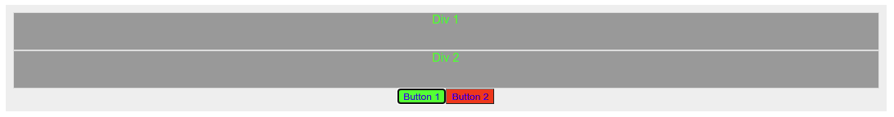

Extended Integration/Расширенная интеграция
===========================================

Этот пример демонстрирует, как интегрировать **@bluepjs** более глубоко: пример будет управлять 2 разделами и 2 кнопками цветами фона и текста и событием ``click`` кнопок:

.. image:: ../_static/example-complex-layout.png
   :alt: Example template view

Чтобы сделать пример более "наглядным", будет создан новый **Module/модуль** со специальными определениями типов (enums, structs, classes),а **Actors/акторы** продемонстрируют **OOP Inheritance/Наследование ООП**.

HTML структура для демонстрации проста:

.. literalinclude:: ../../../source/example/src/views/About.vue
   :language: html
   :lines: 74-79

css:

.. literalinclude:: ../../../source/example/src/views/About.vue
   :language: css
   :lines: 90-99

Module/Модуль
-------------

Давайте сначала посмотрим весь файл, а после опишем его по частям:

.. literalinclude:: ../../../source/example/src/vm/page.module.js
   :caption: example/src/vm/page.module.js
   :language: javascript
   :linenos:

**Module/Модуль** определяет:

 * **enum** ``html/color`` с парами ``cssColor`` - ``Color name``. Полный код типа ``bluep/enum/html/color``
 * **struct** ``element/colors`` с файлами ``background`` и ``text``. Полный код типа ``bluep/struct/element/colors``
 * специальный цвет для **struct**
 * класс ``html/element`` описывает родительский класс модуля акторы. Поскольку родительский класс никогда напрямую не используется **Vm** - его метаданные не могут быть доступны напрямую (из метаданных класса) и предоставляются в метаданных модуля.

 Из-за не очень хорошей демонстрационной архитектуры (IDE использует "backend Vm/серверную виртуальную машину", а демонстрационный модуль работает только на интерфейсе) - инициализация модуля "сложная", и мы инициализируем "пустые" актеры только для получения информации о модуле / актерах для ** IDE**

.. literalinclude:: ../../../source/example/server.js
   :language: javascript
   :lines: 16-18

Но на интерфейсном модуле, инициализированном реальными элементами DOM:

.. literalinclude:: ../../../source/example/src/views/About.vue
   :language: javascript
   :lines: 4,51,54

.. note::

   ``$refs`` is part of Vue 3 framework.

Actors/Акторы
-------------

html/element
~~~~~~~~~~~~

Базовый класс для актеров в этой демонстрации называется "HTML Element" (с кодом "html/element").

.. literalinclude:: ../../../source/example/src/vm/element.actor.js
   :caption: example/src/vm/element.actor.js
   :language: javascript
   :linenos:

Обратите внимание на определение ``_state`` (строка 19). Состояние описано в **Module** метаданных как переменная с кодом ``colors`` типа ``bluep/struct/element/colors``.

.. literalinclude:: ../../../source/example/src/vm/page.module.js
   :language: javascript
   :lines: 64-72

Структура ``element/colors`` описана с 2 файлами типа ``bluep/enum/html/color``:

.. literalinclude:: ../../../source/example/src/vm/page.module.js
   :language: javascript
   :lines: 33-49

И тип перечисления ``html/color`` описан со следующими значениями:

.. literalinclude:: ../../../source/example/src/vm/page.module.js
   :language: javascript
   :lines: 18-29

В результате определение состояния имеет вид:

.. literalinclude:: ../../../source/example/src/vm/element.actor.js
   :language: javascript
   :lines: 19-25

Метод ``colorize``, описанный в **Module** метаданных, прост - он обновляет состояние переменной ``colors`` и css стили html элемента соответственно.

.. literalinclude:: ../../../source/example/src/vm/element.actor.js
   :language: javascript
   :lines: 50-55

html/div
~~~~~~~~

Div Actor очень прост:

.. literalinclude:: ../../../source/example/src/vm/div.actor.js
   :caption: src/vm/div.actor.js
   :language: javascript
   :linenos:

Актор просто расширяет класс ``html/element``. Но акторы этого класса будут использоваться **Vm**, поэтому существует метод ``static metadata()``, описывающий его.

html/button
~~~~~~~~~~~

Кнопка Actor имеет дополнительное событие ``click``

.. literalinclude:: ../../../source/example/src/vm/button.actor.js
   :caption: src/vm/button.actor.js
   :language: javascript
   :linenos:

Actor constructor is oveeriden to bind event listener on element.

Actors are event emitters, and **Vm** manages described events.

Bleuprints
----------

Our **Module** is complete and comnnected to **Vm**. Now all **Actors** behavior will be defined with **Blueprints**.

Vm start
~~~~~~~~

Let's colorize our actors on **Vm** start:

Button 1 click
~~~~~~~~~~~~~~

Click on 1st button will take background color of button and apply it as text color of divs, keeping divs background color same.

.. image:: ../_static/example-complex-btn-1.png
   :alt: Button 1 click

If we click on 1st button - divs text color will become green:

Works! Great! :) But let's do some "code optimization" before we touch 2nd button.

Colorize functions
~~~~~~~~~~~~~~~~~~

Let's create blueprint function to colorize text of our divs. Function will have one input typeof ``bluep/enum/html/color``

.. image:: ../_static/example-complex-colorize.png
   :alt: Colorize blueprint

Function do same thing as "button 1 click" blueprint with difference that text color is provided as input variable.

Now let's do button 2 click blueprint.

Button 2 click
~~~~~~~~~~~~~~

.. image:: ../_static/example-complex-btn-2.png
   :alt: Button 2 click

**colorize** blueprint is called on click with manually defined red color, than function waits for 2000ms (2sec) and call again **colorize** node with blue color input.

Project sources
---------------

Example project with all sources can be found here: https://github.com/bluep-js/example
