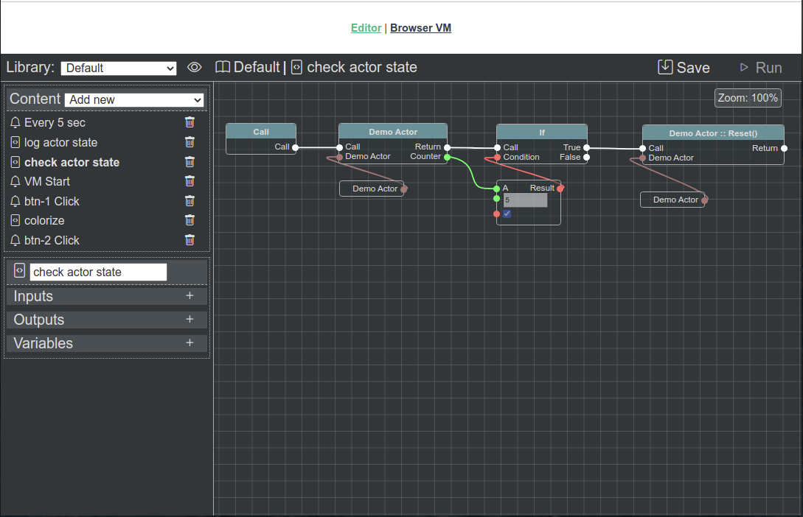

Simple Integration
==================

Defining actor
--------------

.. literalinclude:: ../../../source/example/src/actor.js
   :caption: example/src/actor.js
   :language: javascript
   :linenos:

Actor ``metadata`` contains actor description for **IDE**.

Java Script doesn't supports multi-inheritance, so if **App** (**Module**) **Actors** already has inheritance chain - it may be hard (or even impossible) for **developer** to extend ``AbstractActor`` class. In such situation - ``AbstractActor`` interface should be implemented. **@bluepjs** checks "AbstractActor inheritance" by checking existance of methods.

But at simple case - actors can be directly extended from ``AbstractActor`` what may help **developers** managing code.

Let's see all file first, and describe it by parts after:

.. literalinclude:: ../../../source/example/src/actor.js
   :language: javascript
   :lines: 1,11

Actor define single variable ``counter`` at ``state``:

.. literalinclude:: ../../../source/example/src/actor.js
   :language: javascript
   :lines: 20-26

For this variable in js code ``_tick`` property is initialized:

.. literalinclude:: ../../../source/example/src/actor.js
   :language: javascript
   :lines: 92

and returned at ``state(code)`` method:

.. literalinclude:: ../../../source/example/src/actor.js
   :language: javascript
   :lines: 80-85

To make actor "live" simple 5sec timer is initialized at constructor, incrementing ``_tick`` and firing ``tick`` event:

.. literalinclude:: ../../../source/example/src/actor.js
   :language: javascript
   :lines: 69-72

``tick`` event also described at metadata having one output:

.. literalinclude:: ../../../source/example/src/actor.js
   :language: javascript
   :lines: 44-57

Actor's methods ``set`` and ``reset`` also described in metadata:

.. literalinclude:: ../../../source/example/src/actor.js
   :language: javascript
   :lines: 27-43

and realized in ``method(method, inputs)`` method:

.. literalinclude:: ../../../source/example/src/actor.js
   :language: javascript
   :lines: 105-110

Connecting actor
----------------

.. literalinclude:: ../../../source/example/server.js
   :caption: example/server.js
   :language: javascript
   :lines: 26-31

Blueprints
----------

After created and registered actor - it will be accessible for **Blueprints** scripting:

There are 3 **Blueprints** for demonstration:

.. figure:: ../_static/example-simple-log-actor-state.png
   :alt: Blueprint scripting example

   Log actor state

1st **Bleuprint** named *Log actor state* get's demo actor state variable ``counter``, and print it to console like *Actor counter is: {counter}*.

2nd **Blueprint** is a bit more "complex" - it takes demo actor ``counter`` state, and if it is greater or equal to 5 - call actor's method ``reset``.

   Check actor state

3rd **Blueprint** is *cron event* script, running every 5 seconds. It calls previous **blueprints**.

.. figure:: ../_static/example-simple-cron.png
   :alt: Blueprint scripting example

   Cron event every 5 sec

Results
-------

Results can be seen both on example project frontend and backend:

.. figure:: ../_static/example-simple-result-browser.png
   :alt: Blueprint scripting example

   Vm logs at browser

.. figure:: ../_static/example-simple-result-backend.png
   :alt: Blueprint scripting example

   Vm logs at backend
