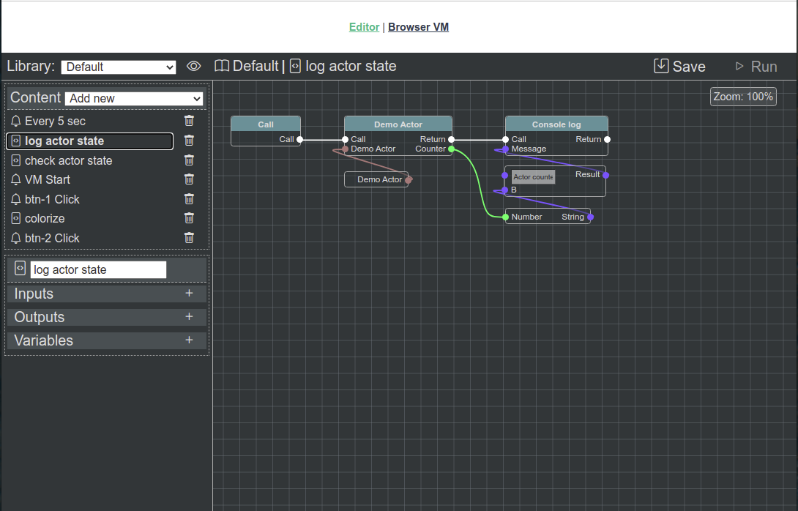
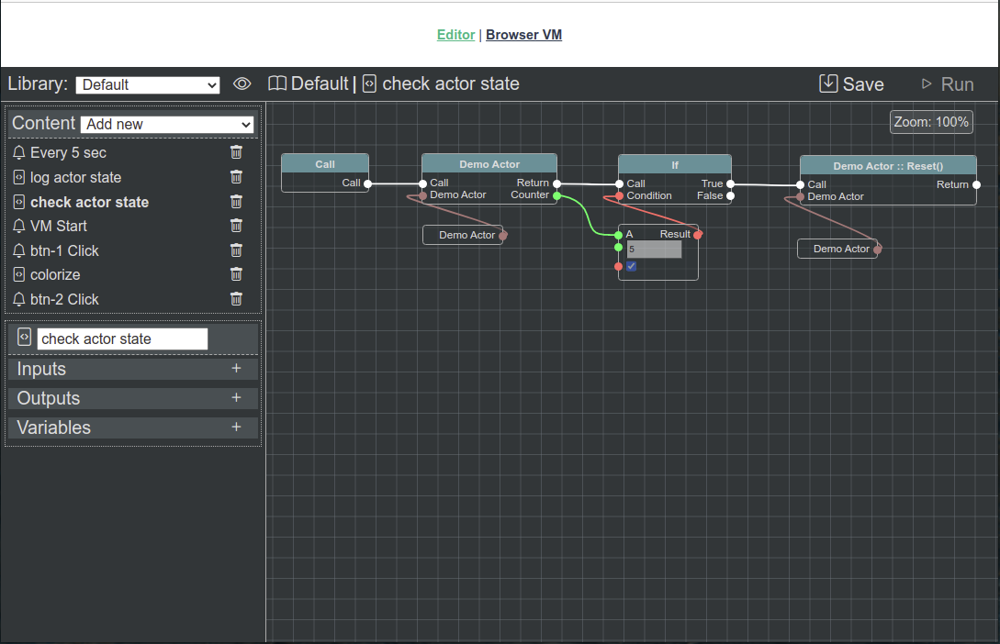
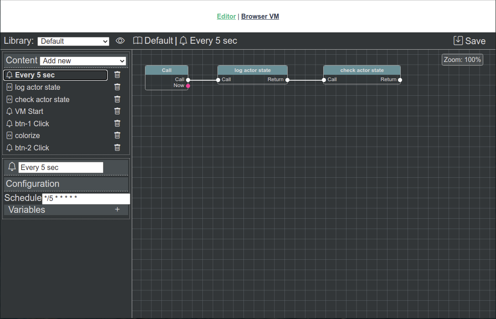
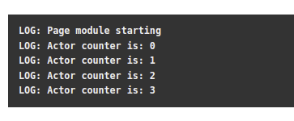
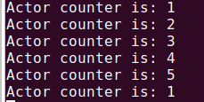

Simple Integration/Простая интеграция
=====================================

Defining actor/Определение актора
---------------------------------

.. literalinclude:: ../../../source/example/src/actor.js
   :caption: example/src/actor.js
   :language: javascript
   :linenos:

Актор ``metadata/метаданные`` содержит описание актора для **IDE**.

Java Script не поддерживает множественное наследование, поэтому, если **App** (**Module**) **Actors** уже имеет цепочку наследования может быть трудно (или даже невозможно) для **developer/разработчика** расширить класс ``AbstractActor``. В такой ситуации следует реализовать интерфейс ``AbstractActor``. **@bluepjs** проверяет "AbstractActor inheritance/наследование" путем проверки существования методов.

Но в простом случае - акторы могут быть напрямую расширены из ``AbstractActor``, что может помочь **developers/разработчикам** в управлении кодом.

Давайте сначала посмотрим весь файл, а потом опишем его по частям:

.. literalinclude:: ../../../source/example/src/actor.js
   :language: javascript
   :lines: 1,11

Актор определяет единственную переменную ``counter`` в ``state``:

.. literalinclude:: ../../../source/example/src/actor.js
   :language: javascript
   :lines: 20-26

Для этой переменной в js-коде инициализируется свойство ``_tick``:

.. literalinclude:: ../../../source/example/src/actor.js
   :language: javascript
   :lines: 92

и возвращается в методе ``state(code)``:

.. literalinclude:: ../../../source/example/src/actor.js
   :language: javascript
   :lines: 80-85

Чтобы сделать актора "live", в конструкторе инициализируется простой 5-секундный таймер, увеличивающий ``_tick`` и запускающий событие ``tick``:

.. literalinclude:: ../../../source/example/src/actor.js
   :language: javascript
   :lines: 69-72

Событие ``tick`` также описано в метаданных и имеет один выход:

.. literalinclude:: ../../../source/example/src/actor.js
   :language: javascript
   :lines: 44-57

Методы актора ``set`` и ``reset`` также описаны в метаданных:

.. literalinclude:: ../../../source/example/src/actor.js
   :language: javascript
   :lines: 27-43

и реализованы в методе ``method(method, inputs)``:

.. literalinclude:: ../../../source/example/src/actor.js
   :language: javascript
   :lines: 105-110

Connecting actor/Подключение актера
-----------------------------------

.. literalinclude:: ../../../source/example/server.js
   :caption: example/server.js
   :language: javascript
   :lines: 26-31

Blueprints/Чертежи
------------------

После создания и регистрации актора - он будет доступен для **Blueprints** сценариев:

Есть три **Blueprints** для демонстрации:

   Состояние журнала актора

Первый **Bleuprint** под названием *Log actor state* получает переменную состояния актора ``counter``, и выводит ее на консоль в виде *Actor counter is: {counter}*.

Второй **Blueprint** немного более "complex/сложный" - он принимает состояние демо-актора ``counter``, , и если оно больше или равно 5 - вызывает метод актора ``reset``.

   Проверка состояния актера

Третий **Blueprint** - это сценарий *cron event*, апускаемый каждые 5 секунд. Он вызывает предыдущие **blueprints**.

   Событие Cron каждые 5 секунд

Results/Результаты
------------------

Результаты можно увидеть как на примере интерфейса проекта, так и на на серверной части проекта:

   Журналы виртуальной машины в браузере

   Журналы виртуальной машины на серверной части
