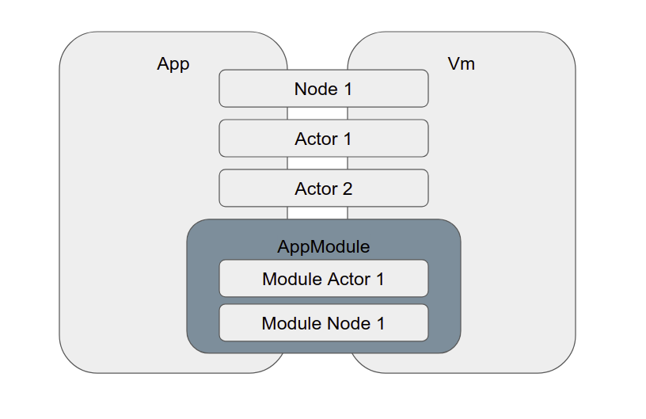

Virtual Machine/Виртуальная машина
==================================

.. _intro:

Intro
-----

@bluepjs Virtual Machine (VM) executes Blueprints.

VM can be used both in browser and nodejs side in same way.

VM doesn't run by itself, store or manage libraries or any states - it designed to be integrated into other projects and managing of libraries/modules/etc should be done outside.

Multiple VM instances can be lauched with different configurations independently.

.. _installation:

Installation
------------

To use VM, first install it using npm:

.. code-block:: console

   npm install @bluepjs/vm

Then import VM class, create VM object and load libraries

.. code-block:: javascript

   import { Vm } from '@bluepjs/vm'

   const vm = new Vm()

   // ... loading libraries from database/network/fs/...
   const libraries = loadLibraries()
   vm.updateLibraries(libraries)

   // start vm
   vm.start().then(() => {
     // do somethig after vm is started
   })

Vm console
----------

By default **Vm** uses environment ``console`` object. This can be overriden with ``Vm::console()`` method:

.. code-block:: javascript

   // redefine vm "console" outputs from "console" if required
   vm.console({
     log: (...args) => { /* log message */ },
     error: (...args) => { /* error message */ },
     debug: (...args) => { /* debug message */ },
   })

Vm debug
--------

**Vm** constructor accepts single boolean argument ``debug`` which enables ``Vm::console().debug()`` messages for default console.

If **Vm** console is overriden - ``debug`` argument do nothing.

Integration Schema
------------------

Main schema of integration looks next:

For simple imtegration - it's enough to create required **Actors** and add them to **Vm** with ``vm.M('actor').addActor(actor)`` method of ``actor`` module.

New **Nodes** can be added with or without **Modules** with ``vm.registerNode(NodeClass)`` **Vm** method.

If **Developer** needs define some ``types``, ``enums``, ``structs`` or ``classes`` - **Module** is required. Simplest module may only define required types.

IDE integration
~~~~~~~~~~~~~~~

VM provides all information about itself (libraries, types, nodes, actors and modules) for IDE with ``ideData()`` method.

.. code-block:: javascript

   const ideData = vm.ideData()

Default Vm Modules
------------------

There are 3 **Modules** included to **Vm** by default. Codes of this **Modules** can't be used for **Developer's** **Modules**

Core
~~~~

``core`` module manages **Vm Start** event and provides ``EventEmitter`` **class** description.

Cron
~~~~

``cron`` module provides and manages **Cron Events**.

Actor
~~~~~

``actor`` module provides **Actors** functionality and management

**Module** provides ``addActor``/``removeActor`` methods to manage VM actors
