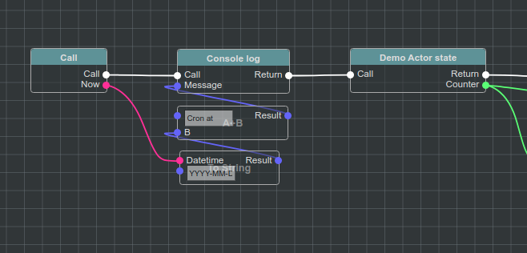

Welcome to @bluepjs documentation!
===================================

**@bluepjs** is a Java Script visual scripting engine library, inspired by Unreal Engine Blueprints system.

Blueprint scripting looks like this:

**@bluepjs** may be integrated into projects required visual scripting of project entities behavior.

Select localization
-------------------

.. toctree::
   :maxdepth: 2

   English <index_en.rst>
   Russian <index_rus.rst>
