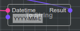

Intro and Terms
===============

In this chapter main **@bluepjs** terms will be introduced without deep details.

**@bluepjs** consists of two main parts:

Virtual Machine (VM)
--------------------

**VM** designed to execute **Blueprints**

*npm install @bleupjs/vm*

Integrated Development Environment (IDE)
----------------------------------------

**IDE** designed to manage **Blueprints** and **Libraries**

*npm install @bleupjs/vue3-ide*

.. note::

   Ok, to be precise in terminology this is not "REAL IDE" - this is more "editor" right now.
   
   "Full IDE" should also include "execution/debugging environment" and this part will be fully implemented later.

.. note::

   Currently IDE build with Vue3 and provided as Vue3 module.

   vite/nuxt/pure/react/etc version will be developed later.

Both parts are independent packages, so can be used as needed.

Other terms, used in code and this documentation are:

Application (App)
-----------------

**@bluepjs** is not a standalone software, but a **scripting engine**.

It's designed to be included into other applications as scripting engine for applications entities.

In this documentation developed application, used **@bluepjs** engine named **Application** (or **App**)

Developer
---------

Person (or group of people) who develops **Application**, **Modules** or **Libraries**

User
----

Person (or group of people) who use **@bluepjs** **IDE** to develop **Application** behavior

Module
------

**@bluepjs** designed to be expandable with 3-rd party code organized into special **Modules**.

**Modules** are designed to be imported/exported by programmers (**Developers**) and may contain new **Nodes**, **Libraries**, **Events**, **Actors** and other entities to expand and organize **@bluepjs** functionaly and can be universal or **App** specific.

.. note::

   Right now modules can add only new **Nodes** and "Global" **Events**

   Full support of all functionality will be added in next versions

Libraries (Libs)
----------------

**Blueprints** are stored and organized in **Libraries**.

**@bluepjs** doesn't care about storing **Libraries** - this part should be done by **Application** - **Library** structure is JSON compatible and can be easy stored in different ways.

**Libraries** designed to be imported/exported by *regular users* as *fiendly reusable modules* and store all required *reusable module* content and scripts.

.. note::

   Right now only single "Default" library is supported

   Full support (use/import/export) will be added in next versions

Actors
------

**Application** entities controlled by **VM** in **@bluepjs** named **Actors**.

They are developed by **Developer** and are **Application**, **Library** or **Module** specific.

**Actors** may have:

  * **State** - readonly **Actor** properties.
  * **Methods** - actions to be executed by **Actor**.
  * **Events** - actions to be fired from **Actor** and managed by **VM**

Events
------

**VM** designed to manage events from **Actors** (**Actor event**) and from **Modules** (also named in  documentation as **Global Event** or **VM Event**).

**Events** may have **Outputs** to transmit event data into **Blueprint**.

**Global Events** may have **Configuration** fields for specific tuning.

.. note::

   In this documentation term **Event** without specification to "Actor", "Global" or "VM" should be specified by context.

Blueprints
----------

**Library** scriptable entities. Can be:

  * **Library** **Function** script
  * **Library** **Class** **Method** script
  * **Library** **Event** script
    
**Blueprints** are constructed with **Nodes** and **Edges** into **Execution Flow** in **IDE**

Nodes
-----

**Nodes** are minimal **Blueprint** scripting block. They can represent Java Script code provided by **Developers** or other **Libraries** **Blueprints**.

**Nodes** has **Inputs** and **Outputs** and may be two different types:

Executable Nodes
~~~~~~~~~~~~~~~~

This **Nodes** has special **Executable Input** and at least one **Executable Output** for **Execution Flow**

For example:

.. image:: ./_static/intro-executable-node.png
   :alt: Executable Node example

.. note::

   **Executable Nodes** are easy recognized by having header

Modifier Nodes
~~~~~~~~~~~~~~

**modifiers** - this **Nodes** doesn't have **Executable Inputs** or **Executable Outputs** and **Execution Flow** of this **Nodes** depends on **Edges**

For example:

Slots (Node Slots)
------------------

**Slot** in this documentation is a common name for any **Node** **Input** or **Output**, so there are **Input Slots** and **Output Slots**

**Slot** color and shape visually represents slot data type.

**Slots** can be connected o disconnected, for example:

Connected **Input Slot** of type ``basic/datetime`` named "Datetime"

.. image:: ./_static/intro-connected-slot.png
   :alt: Connected Input Datetime Slot

Disconnected **Input Slot** of type ``basic/string`` with manual value "Cron at "

.. image:: ./_static/intro-disconnected-slot.png
   :alt: Disconnected Input String Slot

Disconnected **Input Slots** values may be inputed manually

Edges (Connections)
-------------------

**Nodes** connected together with **Edges** by **Slots**.

**Edge** color represents data type of connected **Slots**

For example - **Edge** of type ``basic/datetime`` connecting **Output Slot** named "Now" with **Input Slot** named "Datetime"

.. image:: ./_static/intro-edge.png
   :alt: Edge of type datetime

Execution Flow
--------------

Way of **Nodes** ordering for execution defined by connecting **Nodes** with **Execution Slots**

.. image:: ./_static/intro-execution-flow.png
   :alt: Execution flow example

On example image **Execution Edges** are **a**, **b** and **c** and they define **Nodes** execution order.

Deeper information about **Execution Flow** will be covered in next chapter.
