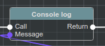
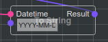
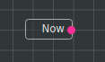
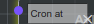
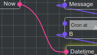
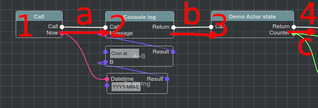

Введение и термины
==================

В этой главе основные термины **@bluepjs** будут представлены без подробных деталей.

**@bluepjs** состоит из двух основных частей:

Виртуальная машина (VM)
-----------------------

**VM** предназначена для выполнения **Blueprints**

*npm install @bleupjs/vm*

**VM** может использоваться как в браузере, так и nodejs тем же способом.

Интегрированная среда разработки (IDE)
--------------------------------------

**IDE** предназначена для управления **Blueprints** и **Libraries**

*npm install @bleupjs/vue3-ide*

.. примечание::

   Ok, если быть точным в терминологии, это не "REAL IDE" - сейчас это больше "editor".
   
   "Full IDE" должна также включать "среду исполнения/отладки", и эта часть будет полностью реализована позже.

.. примечание::

   В настоящее время IDE построена на Vue3 и предоставляется как модуль Vue3e.

   vite/nuxt/pure/react/etc версия будет разработана позже.

Обе части являются независимыми пакетами, поэтому их можно использовать по мере необходимости.

Другие термины, используемые в коде и этой документации:

Application (App)/Приложение
----------------------------

**@bluepjs** это не автономное программное обеспечение, это **скриптовый движок**.

Он предназначен для включения в другие приложения в качестве скриптового движка для объектов приложений.

В данной документации разработано приложение, использующее **@bluepjs** движок с именем **Application** (или **App**)

Developer/Разработчик
-----------------------

Человек (или группа людей), который разрабатывает **Application/Приложение**, **Modules/Модули** or **Libraries/Библиотеки**.

User/Пользователь
-----------------

Человек (или группа людей), которые используют **@bluepjs** **IDE** для разработки поведения **Application/Приложения**.

Module/Модуль
-------------

**@bluepjs** разработан таким образом, чтобы его можно было расширять за счет стороннего кода, организованного в специальные **Modules/Модули**.

**Modules/Модули** предназначены для импорта/экспорта программистами (**Developers/Разработчиками**) и могут содержать новые **Nodes/узлы**, **Libraries/библиотеки**, **Events/события**, **Actors/акторы** и другие объекты для расширения и организации **@bluepjs** функциональности и могут быть универсальными илиспецифичными для каждого **App/приложения**.

Libraries (Libs)/Библиотеки
---------------------------

**Blueprints** хранятся и организуются в **Libraries/библиотеки**.

**@bluepjs** не заботится о хранении **Libraries/библиотек** - эта часть должна выполняться **Application/приложениями** - структура **Library/библиотек** совместима с JSON и может быть легко сохранена различными способами.

**Libraries/библиотеки** предназначены для импорта /экспорта *обычными пользователями* в виде *модулей многократного использования* и хранения всего необходимого содержимого *модуля многократного использования* и скриптов.

.. примечание::

   Прямо сейчас поддерживается только одна библиотека "По умолчанию".

   Полная поддержка (использование / импорт / экспорт) будет добавлена в следующих версиях.

Actors/Акторы
-------------

**Application/приложения** по сути управляемые **VM/ВМ** in **@bluepjs** под названием **Actors/Акторы**.

Они разработаны **Developer/Разработчиком** и относятся к **Application/Приложениям**, **Library/Библиотекам** или **Module/Модулям**.

**Actors/Акторы** могут иметь:

  * **State/Состояние** - свойства **Actor/Актора** только для чтения.
  * **Methods/Методы** - действия, выполняемые **Actor/Актором**.
  * **Events/События** - действия, выполняемые **Actor/Актором** и управляемые **VM/ВМ**.

Events
------

**VM** designed to manage events from **Actors** (**Actor event**) and from **Modules** (also named in  documentation as **Global Event** or **VM Event**).

**Events** may have **Outputs** to transmit event data into **Blueprint**.

**Global Events** may have **Configuration** fields for specific tuning.

.. note::

   In this documentation term **Event** without specification to "Actor", "Global" or "VM" should be specified by context.

Blueprints
----------

**Library** scriptable entities. Can be:

  * **Library** **Function** script
  * **Library** **Class** **Method** script
  * **Library** **Event** script
    
**Blueprints** are constructed with **Nodes** and **Edges** into **Execution Flow** in **IDE**

Nodes
-----

**Nodes** are minimal **Blueprint** scripting block. They can represent Java Script code provided by **Developers** or other **Libraries** **Blueprints**.

**Nodes** has **Inputs** and **Outputs** and may be two different types:

Executable Nodes
~~~~~~~~~~~~~~~~

This **Nodes** has special **Executable Input** and at least one **Executable Output** for **Execution Flow**

For example:

.. note::

   **Executable Nodes** are easy recognized by having header

Modifier Nodes
~~~~~~~~~~~~~~

**modifiers** - this **Nodes** doesn't have **Executable Inputs** or **Executable Outputs** and **Execution Flow** of this **Nodes** depends on **Edges**

For example:

Getter Nodes
~~~~~~~~~~~~

**getters** - this **Nodes**, same as **modifiers** doesn't have **Executable Slots**. Also, they don't have **Input slots** and have only **Output slots** (regulary - one).

Slots (Node Slots)
------------------

**Slot** in this documentation is a common name for any **Node** **Input** or **Output**, so there are **Input Slots** and **Output Slots**

**Slot** color and shape visually represents slot data type.

**Slots** can be connected o disconnected, for example:

Connected **Input Slot** of type ``basic/datetime`` named "Datetime"

Disconnected **Input Slot** of type ``basic/string`` with manual value "Cron at "

Disconnected **Input Slots** values may be inputed manually

Edges (Connections)
-------------------

**Nodes** connected together with **Edges** by **Slots**.

**Edge** color represents data type of connected **Slots**

For example - **Edge** of type ``basic/datetime`` connecting **Output Slot** named "Now" with **Input Slot** named "Datetime"

Execution Flow
--------------

Way of **Nodes** ordering for execution defined by connecting **Nodes** with **Execution Slots**

On example image **Execution Edges** are **a**, **b** and **c** and they define **Nodes** execution order.

Deeper information about **Execution Flow** will be covered in next chapter.
