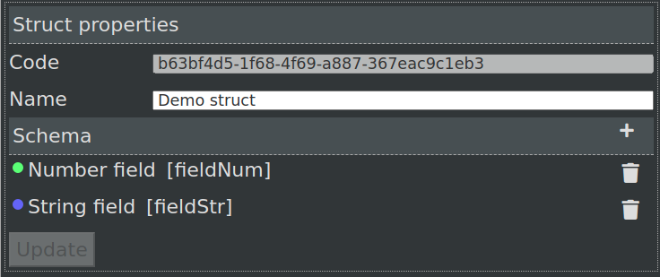
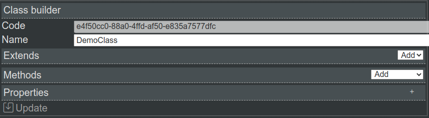

Blueprints scripting
====================

**Blueprint Visual Scripting** is a powerfull scripting system based on the concept of using a node-based interface. This system is extremely flexible and powerful as it provides the ability to use virtually the full range of concepts and tools generally only available to programmers.

**@bluepjs** was inspired by the `Epic Games Unreal Engine Blueprint System <https://docs.unrealengine.com/4.27/en-US/ProgrammingAndScripting/Blueprints/>`_.

Types
-----

**@bluepjs** is a pseudo-typed scripting language. **@bluepjs** **VM** running in Java Script which is dynamic-typed, so all "**Blueprint** code" runing in **VM** really is dynamic typed. Dynamic types in Java Script is double-sided question - on one side it gives to developer fast and simple code development, and on other - it it may surprise developer on automatic types convering.

**Blueprint** concept is fixed typed and **@bluepjs** **IDE** fully implements this concept because it works great here:

  * different types have different colors what helps visually difference them
  * **IDE** block **Edge** connection when **User** try connect type-incompatible **Slots**.

**@bluepjs** has base set of types, but it can be extended same in programmatic way with **Modules**, same with types defined with **IDE**

Base Types
~~~~~~~~~~

``basic/boolean``

  Boolean type - yes/no, 1/0, true/false, on/off

``basic/number``

  Integer numbers - 0, -100, 44, ...

``basic/float``

  Float numbers - 1.23, -3.987, ...

``basic/string``

  Strings - "Hello world!", "Abc de fg", ...

``basic/datetime``

  Date and time.

``basic/date``

  Date only

``basic/time``

  Time only

``basic/object``

  Java Script object

Special Types
~~~~~~~~~~~~~

``basic/execute``

  This is special type to define **Execution Flow**

``basic/template``

  Special type for **Nodes** which may work with different types

@bluepjs Types
~~~~~~~~~~~~~~

``bluep/enum``

  Base type for **Enums**

``bluep/struct``

  Base type for **Structs**

``bluep/function``

  Base type for **Functions** (!Not implemented currently)

``bluep/class``

  Base type for **Classes**

``bluep/object``

  Base type for **Blueprint Objects** (!Not implemented currently)

User defined types
~~~~~~~~~~~~~~~~~~

When **User** creates **enums**, **structs** or **classes** in **Libraries** - new **types** appear in type selectors and nodes for this types are auto-generated by **IDE**.

Libraries Content
-----------------

By default each **VM** doesn't contains any **Blueprints** - they all are stored in **Librararies**.

Each **Library** contains user defined types and functions.

Each element in **Libraries** has **code** which should be unique inside **Libraries**.

.. note::

   UUID v4 is used to generate elements codes.

Library selector located at top bar on the left.

Modules content
~~~~~~~~~~~~~~~

**Modules** also may provide additional **enums**, **structs** and **classes** for **Vm**. This content, defined inside **Modules** can't be changed or removed by **User**.

Library
~~~~~~~

Default library with code ``default`` is always exists, used and can't be removed.

Each **Library** may include **enums**, **structs**, **functions** and **classes**.

.. note::

   Currently, there is only single library "default".

   This will be updated later

**Library content panel** allows see and manage **Library** content.

.. image:: ../_static/user-blueprint-library-content.png
   :alt: Library content panel

To create new element in **Library** - use selector on the header of **Library content panel**.

.. image:: ../_static/user-blueprint-library-add.png
   :alt: Add content to library

Enums
~~~~~

**Enum** is a dictionary with predefined values.

Example:

.. image:: ../_static/user-blueprint-enum.png
   :alt: Enum example

Structs
~~~~~~~

**Struct** is a union of different data types into new "complex" type.

Example:

Example "Demo struct" contains 2 fields:

 * field named *Number field* with code ``fieldNum`` type of ``basic/number``
 * field named *String field* with code ``fieldStr`` type of ``basic/string``

.. note::

  **code** for **struct** fields are defined by **User**.

  It's required for converting JavaScript objects into @bluep **struct** and back.

Classes
~~~~~~~

Speacking simple - **Class** is "upgraded" **struct** with **functions**.

**Classes** concept is part of **Object Oriented Programming**.

**@bluepjs** supports next **OOP** concepts:

  * Encapsulation
  * **Inheritance** - **classes** may extends other classes. **Multi-inheritance** is supported.
  * Polymorphism - **Vm** will control overriden methods and choose correct.
  * Properties and methods access control - **public**/**private**/**protected**
  * Constructors - **@bluepjs** supports **only** constructors - not destructors.
  * **this** concept (**getter** node)

Example of empty class:

.. note::

  This documentation doesn't has a goal to describe **OOP** by itself. 
  If you don't know **OOP** - you should learn it by yourself.

  You can use **@bluepjs** without **OOP** knowledges.

Functions
~~~~~~~~~

**Functions** are special **Library** executable entities.

**Enums**, **struct** and **classes** describe **data types** (simple or complex) - and **functions** can be executed by **Vm**.

There are next types of **functions** in **@bluepjs**:

  * Simple functions - can be executed by **Vm** on **User** request (by clicking "Run" button). Also they can be used in other **functions** as **Node**. **Inputs** and **Outputs** for **function** are defined by **User** using **IDE**
  * Event functions - executed automatically by **Vm** when corresponding **event** happens. **Events** can be provided by **Modules** and **Actors**. **Event** **Inputs** are defined by **Developer** (of **Module**/**Actor**). **Events** has no **Outputs**.
  * Class Constructors - executed by **Vm** when object of **class** is created. **IDE** automatically generates required **Nodes**.
  * Class Methods - executed by **Vm** when corresponding method is called. **IDE** automatically generates required **Nodes**.

For defining **Function** behavior - **Blueprint** editor is used.

Example of function blueprint:

.. image:: ../_static/user-blueprint-function.png
   :alt: Function blueprint example

Execution Flow in Depth
-----------------------

**Execution flow** defined by connecting **Execution Outputs** and **Execution Inputs** of different **Execution Nodes** what creates **Execution Edge**.

.. image:: ../_static/intro-execution-flow.png
   :alt: Function blueprint execution flow simple

On example image **Execution Nodes** are **1**, **2** and **3**, and **Execution Edges** are **a**, **b** and **c**.

Execution Context
~~~~~~~~~~~~~~~~~

For each **Blueprint** execution **Vm** generates closed "sandbox" where all data of execution is stored. This "sandbox" in **@bluepjs** named **Execution Context**. 

**Context** exists while **Bluprint** is executed by **Vm** and destroyed on execution complete.

**Context** is hidden from **User** but accessible for **Developer**.

For **methods** and **constructors** types of **functions** special **this** entity exists for **context** pointing to object of class.

Call Node
~~~~~~~~~

**Blueprint** Execution starts from special **Call Node**. It can be only one **Call Node** per **Blueprint**. 

**Outputs** of **Call Node** are auto-defined by **Function inputs**.

Example of **Call Node** for **function** without **Inputs**:

.. image:: ../_static/user-blueprint-call-node.png
   :alt: Call Node example

Return Node
~~~~~~~~~~~

Execution follows to **Execution Edges** of **Nodes** until there are **Execution Edges**.

If **Function** has **Outputs** - special **Return Node** should be used to set them.

Example of **Call Node** for **function** with sing **Output** of type ``basic/string`` named "outputs 0":

.. image:: ../_static/user-blueprint-return-node.png
   :alt: Return Node example

If **Return Node** is not connected to **Execution flow** - **function** **outputs** are undefined.

Modifiers and Getters Nodes execution
~~~~~~~~~~~~~~~~~~~~~~~~~~~~~~~~~~~~~

When **Node** executes - it sets it's **Outputs**, so when **Node** is executed - **Execution Context** contains output data.

Before **Vm** executes any **Node** it prepares **Node** **Inputs**. If **Input slot** of **Node** is connected to other **Node** - **Vm** will execute it automatically, to prepare required **Inputs**.

Example:

.. image:: ../_static/user-blueprint-execution-flow.png
   :alt: Execution flow in depth

Full **Execution Flow** for **Blueprint** is next:

  1. **Call Node** (**1**) is executed, set it's "now" output to **Context**
  2. **Vm** checks **Execution Edge** (**a**) and found next **Node** to execute (**2**)
  3. **Vm** prepares **Node** **Inputs** and found that **Input slot** "Message" is connected to **Output** of **Node** "String Append" (**2a**).
  4. **Vm** prepares **2a** to execute and found that first **Input Slot** is defined manualy, but second **Input slot** connected with another **Node** (**2b**)
  5. **Vm** prepares **2b** to execute and found that first **Input Slot** is defined manualy and second **Input Slot** connected to **Node** with defined (in **Context**) **Output**.
  6. Because all **inputs** for **2b** are ready - **2b** node is executed and set its **output**
  7. Because now all **inputs** for **2a** are ready - **2a** is executed and set its **output**
  8. Because now all **inputs** for **2** are ready - **2** is executed and set its **outputs**
  9. **Vm** checks **Execution Edge** **b** and found **Node** **3**.
  10. Preparing **Node** **3** to execute - **Vm** found no **Node** **Inputs** so **Node** is executing set its **outputs**
  11. **Vm** checks **Execution Edge** **c** and found **Node** **4**.. and so on

Main difference between **Execution Nodes** and **Modifier/Getter Nodes** is that **Modifiers/Getters Nodes** are executed every time when theirs **Outputs** are required, and **Execution Nodes** are executed only according to **Execution Edges**.
