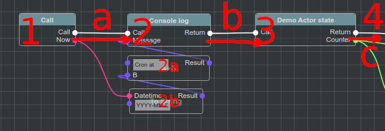

Сценарии Blueprints
===================

**Blueprint Visual Scripting/библиотека визуального программирования** -  это мощная система создания сценариев, основанная на концепции использования интерфейса на основе узлов. Эта система является чрезвычайно гибкой и мощной, поскольку она предоставляет возможность использовать практически весь спектр концепций и инструментов, обычно доступных только программистам.

**@bluepjs** был вдохновлен `Epic Games Unreal Engine Blueprint System <https://docs.unrealengine.com/4.27/en-US/ProgrammingAndScripting/Blueprints/>`_.

Types/Типы
----------

**@bluepjs** - это псевдо-типизированный скриптовый язык. **@bluepjs** **VM** работает на Java Script, который является динамически типизированным, поэтому весь "**Blueprint** код" выполняемый в **VM**, действительно имеет динамическую типизацию. Динамические типы в Java Script - это двусторонний вопрос: с одной стороны, это дает разработчику быструю и простую разработку кода, а с другой - это может удивить разработчика автоматическим преобразованием типов.

Концепция **Blueprint** - фиксированная типизация, и **@bluepjs** **IDE** полностью реализует эту концепцию, потому что она отлично работает здесь:

  * разные типы имеют разные цвета, что помогает визуально отличать их
  * **IDE** блокирует **Edge** соединение, когда **User** пытается соединить несовместимые по типу **Slots**.

**@bluepjs** имеет базовый набор типов, но он может быть расширен программно с помощью **Modules**, также как и типы, определенные с помощью **IDE**

Base Types/Базовые типы
~~~~~~~~~~~~~~~~~~~~~~~

``basic/boolean``

  Boolean type - yes/no, 1/0, true/false, on/off

``basic/number``

  Integer numbers - 0, -100, 44, ...

``basic/float``

  Float numbers - 1.23, -3.987, ...

``basic/string``

  Strings - "Hello world!", "Abc de fg", ...

``basic/datetime``

  Date and time.

``basic/date``

  Date only

``basic/time``

  Time only

``basic/object``

  Java Script object

Special Types/Специальные типы
~~~~~~~~~~~~~~~~~~~~~~~~~~~~~~

``basic/execute``

  Это специальный тип для определения **Execution Flow**

``basic/template``

  Специальный тип для **Nodes**, которые могут работать с различными типами

Типы @bluepjs
~~~~~~~~~~~~~

``bluep/enum``

  Базовый тип для **Enums/Перечислений**

``bluep/struct``

  Базовый тип для **Structs/Структур**

``bluep/function``

  Базовый тип для **Functions/Функций** (!в настоящее время не реализован)

``bluep/class``

  Базовый тип для **Classes/Классов**

``bluep/object``

  Базовый тип для **Blueprint Objects/Объектов** (!в настоящее время не реализован)

Типы, определяемые пользователем
~~~~~~~~~~~~~~~~~~~~~~~~~~~~~~~~

Когда **User/Ползователь** создает **enums/перечисления**, **structs/структуры** или **classes/классы** в **Libraries/Библиотеках** - новые  **types/типы** появляются в селекторах типов и узлы для этих типов автоматически генерируются **IDE**.

Содержание библиотек
--------------------

По умолчанию каждая **VM** не содержит никаких **Blueprints** - - все они хранятся в **Librararies/Библиотеках**.

Каждая **Library/Библиотека** содержит определенные пользователем типы и функции.

Каждый элемент в **Libraries/Библиотеках** имеет **code/код** который должен быть уникальным внутри **Libraries/Библиотек**.

.. note::

   Для генерации кодов элементов используется UUID v4.

Селектор библиотек расположен на верхней панели слева.

.. image:: ../_static/user-blueprint-libraries-widget.png
   :alt: Library widget

Содержание модулей
~~~~~~~~~~~~~~~~~~

**Modules/Модули** также могут предоставлять дополнительные **enums/перечисления**, **structs/структуры** и **classes/классы** для **Vm**. Это содержимое, определенное внутри **Modules/Модулей**, не может быть изменено или удалено **User/Пользователем**.

Library/Библиотека
~~~~~~~~~~~~~~~~~~

Библиотека по умолчанию с кодом ``default`` всегда существует, используется и не может быть удалена.

Каждая **Library/Библиотека** может включать в себя **enums/перечисления**, **structs/структуры**, **functions/функции** и **classes/классы**.

.. note::

   В настоящее время существует только одна библиотека "default".

   Она будет обновлена позже

**Library content panel/Панель содержимого библиотеки** позволяет просматривать и управлять содержимым **Library/Библиотеки**.

Чтобы создать новый элемент в **Library/Библеотеке** - используйте селектор на заголовке **Library content panel/Панель содержимого библиотеки**.

Enums/Перечисления
~~~~~~~~~~~~~~~~~~

**Enum** - это словарь с предопределенными значениями.

Пример:

Structs/Структуры
~~~~~~~~~~~~~~~~~

**Struct** - это объединение различных типов данных в новый "сложный" тип.

Пример:

.. image:: ../_static/user-blueprint-struct.png
   :alt: Struct example

Пример "Demo struct" содержит 2 поля:

 * поле с именем *Number field* с кодом ``fieldNum`` тип ``basic/number``
 * поле с именем *String field* с кодом ``fieldStr`` тип ``basic/string``

.. note::

  **code/код** для полей **struct/структуры** определяется **User/пользователем**.

  Он необходим для преобразования объектов JavaScript в @bluep **struct** и обратно.

Classes/Классы
~~~~~~~~~~~~~~

Говоря проще - **Class/Класс** - это "upgraded/модернизированная" **struct/структура** с **functions/функциями**.

Концепция **Classes/Классов** является частью **Object Oriented Programming/объектно-ориентированного программирования**.

**@bluepjs** поддерживает следующие **OOP** концепции:

  * Encapsulation/Инкапсуляция
  * **Inheritance/Наследование** - **classes/классы** могут расширять другие классы. Поддерживается **Multi-inheritance/Мульти-наследование**.
  * Polymorphism/Полиморфизм  - **Vm** будет контролировать переопределенные методы и выбирать правильные.
  * Контроль доступа к свойствам и методам - **public/общедоступные**/**private/частные**/**protected/защищенные**
  * Constructors/Конструкторы  - **@bluepjs** поддерживает **only/только** конструкторы - не деструкторы.
  * **this/эта** концепция (**getter/получатель** узел)

Пример пустого класса:

.. image:: ../_static/user-blueprint-class.png
   :alt: Class builder example

.. note::

  Эта документация не имеет цели описать **OOP** сама по себе.  
  Если вы не знаете **OOP** - вы должны изучить его самостоятельно.

  Вы можете использовать **@bluepjs** без знания **OOP**.

Functions/Функции
~~~~~~~~~~~~~~~~~

**Functions/Функции** - это специальные исполняемые сущности **Library/Библиотеки**.

**Enums/перечисления**, **struct/структуры** и **classes/классы** описывают **data types/типы данных** (простые или сложные) - и **functions/функции** могут быть выполнены **Vm**.

В **@bluepjs** существуют следующие типы **functions/функций**:

  * Simple functions/Простые функции - могут быть выполнены **Vm** по запросу **User/Пользователя** (нажатием кнопки "Run"). Также они могут быть использованы в других **functions/функциях** как **Node/Узлы**. **Inputs/Входы** и **Outputs/Выходы** для **function/функции** определяются **User/Пользователем** с помощью **IDE**.
  * Event functions/Событийные функции - выполняются автоматически **Vm**, когда происходит соответствующее **event/событие**. **Events/События** могут быть предоставлены **Modules/Модулями** и **Actors/Акторами**.**Inputs/Входы** **Event/События** определяются  **Developer/Разработчиком** (**Module/модуля**/**Actor/актора**). **Events/События** не имеют **Outputs/Выходов**.
  * Class Constructors/Конструкторы классов - выполняются **Vm** при создании объекта **class/класса**. **IDE** автоматически генерирует необходимые **Nodes/узлы**.
  * Class Methods/Методы класса - выполняются **Vm** при вызове соответствующего метода. **IDE** автоматически генерирует необходимые **Nodes/узлы**.

Для определения поведения **Function/функции** используется редактор **Blueprint**.

Пример функции blueprint:

Execution Flow in Depth/Поток выполнения в глубину
--------------------------------------------------

**Execution flow/Поток выполнения** определяется путем соединения **Execution Outputs/выходов исполнения** и **Execution Inputs/входов исполнения** различных **Execution Nodes/узлов исполнения**, что создает **Execution Edge/связки исполнения**.

.. image:: ../_static/intro-execution-flow.png
   :alt: Function blueprint execution flow simple

На изображении примера **Execution Nodes/Исполнительные узлы** - это **1**, **2** и **3**, а **Исполнительные связки** - это **a**, **b** and **c**.

Execution Context/Контекст исполнения
~~~~~~~~~~~~~~~~~~~~~~~~~~~~~~~~~~~~~

Для каждого выполнения **Blueprint** **Vm** генерирует закрытую "sandbox/песочницу" , где хранятся все данные выполнения. Эта "sandbox/песочница" в **@bluepjs** называется **Execution Context/Контекстом выполнения**. 

**Context/Контекст** существует, пока **Bluprint** выполняется **Vm** и уничтожается по завершении выполнения.

**Context/Контекст** скрыт от **User/Пользователя**, но доступен для **Developer/Разработчика**.

Для **methods/методов** и **constructors/конструкторов** типов **функций** существует специальная сущность **this** для **context/контекста**, указывающая на объект класса.

Call Node/Узел вызова
~~~~~~~~~~~~~~~~~~~~~

**Blueprint** Выполнение начинается со специального **Call Node/Узла вызова**. Это может быть только один **Call Node/Узел вызова** на **Blueprint**. 

**Outputs/Выходы** **Call Node/Узла вызова** автоматически определяются **Function inputs/Входами функции**.

Пример **Call Node/Узла вызова** для **function/функции** без **Inputs/входов**:

.. image:: ../_static/user-blueprint-call-node.png
   :alt: Call Node example

Return Node/Возвращаемый узел
~~~~~~~~~~~~~~~~~~~~~~~~~~~~~

Выполнение следует до **Execution Edges/Связок выполнения** **Nodes/узлов**, пока не будет **Execution Edges/Связок выполнения**.

Если **Function/Функция** имеет **Outputs/Выходы** - для их задания следует использовать специальный **Return Node/Узел возврата**.

Пример **Call Node/Вызывающего узла** для **function/функции** с единственным **Output/Выходом** типа ``basic/string`` с именем "outputs 0":

.. image:: ../_static/user-blueprint-return-node.png
   :alt: Return Node example

Если **Return Node/Узел возврата** не подключен к **Execution flow/Потоку выполнения** - **функция** **выходы** не определена.

Modifiers and Getters Nodes execution/Модификаторы и Получатели Узлов выполнения
~~~~~~~~~~~~~~~~~~~~~~~~~~~~~~~~~~~~~~~~~~~~~~~~~~~~~~~~~~~~~~~~~~~~~~~~~~~~~~~~

Когда **Node/Узел** выполняется - он устанавливает свои **Outputs/Выходы**, поэтому когда **Node/Узел** выполняется - **Execution Context/Контекст выполнения** содержит выходные данные.

Прежде чем **Vm** выполнит любой **Node/Узел**, он подготавливает **Node/Узлу** **Inputs/Входы**. Если **Input slot/Входной слот** **Node/узла** подключен к другому **Node/Узлу** - **Vm** выполнит его автоматически, чтобы подготовить необходимые **Inputs/Входы**.

Пример:

Полный **Execution Flow/Поток выполнения** для **Blueprint** выглядит следующим образом:

  1. **Call Node** (**1**) is executed, set it's "now" output to **Context**
  2. **Vm** checks **Execution Edge** (**a**) and found next **Node** to execute (**2**)
  3. **Vm** prepares **Node** **Inputs** and found that **Input slot** "Message" is connected to **Output** of **Node** "String Append" (**2a**).
  4. **Vm** prepares **2a** to execute and found that first **Input Slot** is defined manualy, but second **Input slot** connected with another **Node** (**2b**)
  5. **Vm** prepares **2b** to execute and found that first **Input Slot** is defined manualy and second **Input Slot** connected to **Node** with defined (in **Context**) **Output**.
  6. Because all **inputs** for **2b** are ready - **2b** node is executed and set its **output**
  7. Because now all **inputs** for **2a** are ready - **2a** is executed and set its **output**
  8. Because now all **inputs** for **2** are ready - **2** is executed and set its **outputs**
  9. **Vm** checks **Execution Edge** **b** and found **Node** **3**.
  10. Preparing **Node** **3** to execute - **Vm** found no **Node** **Inputs** so **Node** is executing set its **outputs**
  11. **Vm** checks **Execution Edge** **c** and found **Node** **4**.. and so on

Main difference between **Execution Nodes** and **Modifier/Getter Nodes** is that **Modifiers/Getters Nodes** are executed every time when theirs **Outputs** are required, and **Execution Nodes** are executed only according to **Execution Edges**.
