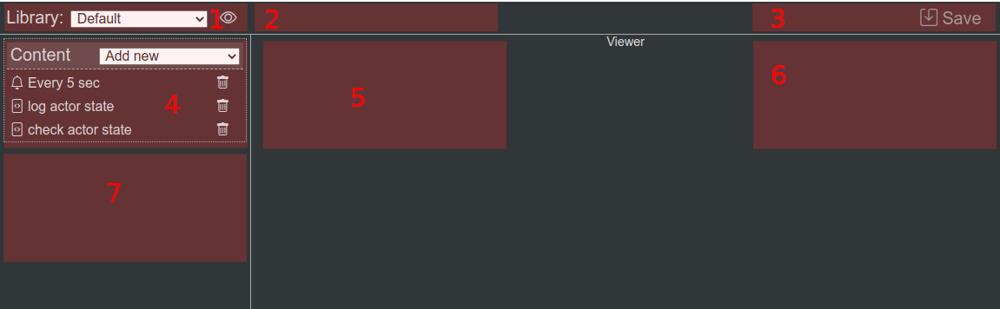
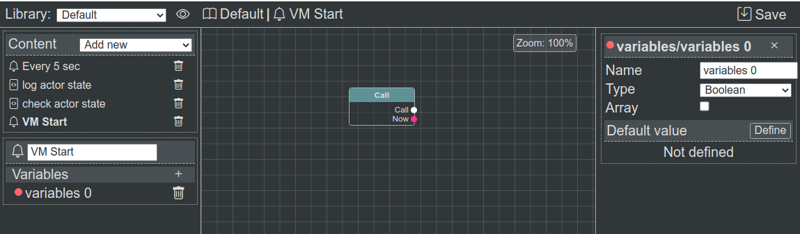
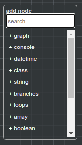

IDE
===

**@bluepjs** **IDE** allows manage **Libraries Content** for **Vm**.

.. note::

   IDE is under development, some functionality may be buggy.

Vm integration
--------------

**IDE** by itself doesn't contains any information about **types**, **nodes** or anything else and should be configured to work properly.

**@bluepjs** designed to get all required information for **IDE** from **Virtual Machine** using method ``Vm::ideData()``. On this method **Vm** collects all information about existing **types**, **nodes**, **modules** and **actors** for **IDE** so all required for **Blueprints** **Nodes** can be auto-generated.

Layout
------

Main **IDE** contains:

1. **Libraries** selector and **Library options** button.
2. Selected element information
3. Control buttons - *Save* to fire save events, *Run* - to run selected **function** in **Vm**
4. Library content panel.
5. Editor of selected element
6. Editor of selected variable
7. Editor/viewer of selected **function** configurations, inputs, outputs and variables

Example of **IDE** with selected **Event function** "VM Start" and selected variable "variables 0":

IDE controls
------------

For most operations **IDE** should be quite intuitive, except next points:

1. *Update* and *Save* buttons. Editing **enums**, **structs** and **classes** *Update* button apply changes for **IDE**. Main *Save* button (at top-left) fires event for **App** to save **Libraries**
2. **Blueprints Editor**:

  1. To drag field - use **Alt + left mouse hold** or **middle mouse** (wheel button)
  2. To disconnect **Edge** - use **Alt + left mouse click** on **Slot connector**

Add Node Context Menu
---------------------

To add **Nodes** to **Blueprint** - use **right click** at point where new node should be located.

Nodes are organized into 3 level deep tree.

.. note:: 

   Current nodes tree is no very intuitive.
   Search is not very helpfull sometimes also.

   It's a known problem.
