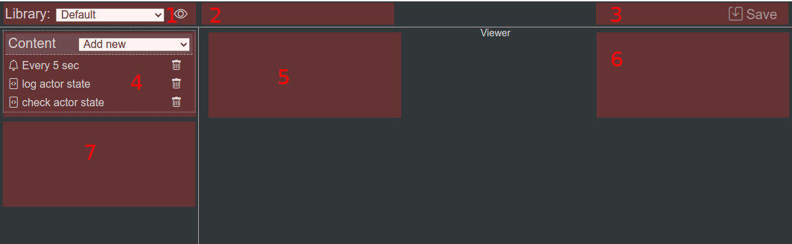
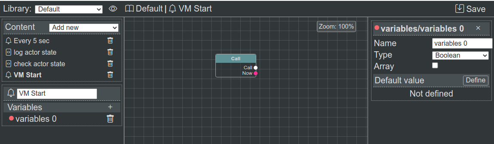

IDE/Интегрированная среда разработки
====================================

**@bluepjs** **IDE** позволяет управлять **Libraries Content/Содержимым Библиотек** для **Vm/Виртуальной Машины**.

.. note::

   IDE  находится в стадии разработки, некоторые функции могут быть с ошибками.

Vm integration/Интеграция с виртуальной машиной
-----------------------------------------------

**IDE** сама по себе не содержит никакой информации о **types/типах**, **nodes/узлах** или чем-либо еще и должна быть настроена для корректной работы.

**@bluepjs** предназначен для получения всей необходимой информации для **IDE** из **Virtual Machine** с помощью метода ``Vm::ideData()``. Этот метод **Vm** собирает всю информацию о существующих **types/типах**, **nodes/узлах**, **modules/модулях** и **actors/акторах** для **IDE**, так что все необходимое для **Blueprints** **Nodes** может быть автоматически сгенерировано.

Layout/Макет
------------

Главная **IDE** содержит:

1. Селектор **Libraries/Библиотеки** и кнопка **Library options/Опции библиотек**
2. Информация о выбранном элементе
3. Кнопки управления - *Save/Сохранить* для запуска событий сохранения, *Run/Выполнить* - для запуска выбранной **function/функции** в **Vm**
4. Панель содержимого библиотеки
5. Редактор выбранного элемента
6. Редактор выбранной переменной
7. Редактор/просмотр выбранных **function/функций** конфигураций, входов, выходов и переменных

Пример **IDE** с выбранной **Event function/Функцией события** "VM Start/Запуск виртуальной машины" и выбранной переменной "variables 0":

IDE controls/Элементы управления IDE
------------------------------------

Для большинства операций **IDE** должна быть достаточно интуитивно понятной, за исключением следующих пунктов:

1. Кнопки *Update/Обновить* и *Save/Сохранить*. Редактирование **enums/перечислений**, **structs/структур** и **classes/классов**. Кнопка *Update/обновления* применяет изменения для **IDE**. Основная кнопка *Save/Сохранить* (слева вверху) запускает событие для **App/Приложения**, чтобы сохранить **Libraries/Библиотеки**.
2. **Blueprints Editor/Редактор**:

  1. Для перетаскивания поля - используйте **Alt + удержание левой кнопки мыши** или **среднюю кнопку мыши** (колесико)
  2. Чтобы отсоединить **Edge/Связки** - используйте **Alt + щелчок левой кнопкой мыши** на **Slot connector/Слот разъема**

Контекстное меню добавления узла
--------------------------------

Чтобы добавить **Nodes/Узлы** в **Blueprint** - используйте **правый клик** в точке, где должен быть расположен новый узел.

.. image:: ../_static/ide-context-menu.png
   :alt: Add node context menu

Узлы организованы в 3-уровневое дерево.

.. note:: 

   Текущее дерево узлов не очень интуитивно понятно.
   Поиск иногда тоже не очень помогает.

   Это известная проблема.
