Default Nodes
=============

**@bluepjs** coming with default set of **Nodes**. New **Nodes** can be added be **Developers**

.. note::

   Current list of **Nodes** is small cuz was developed "on demand" and doesn't contains all basic operations with different types.

   New **Nodes** will be updated in next versions.

Booleans
--------

And (A && B)
~~~~~~~~~~~~

.. image:: ../_static/nodes/boolean-and-or.png
   :alt: boolean and

Modifier node with multiple inputs.

Set output "Result" as logical AND of inputs.

Or (A || B)
~~~~~~~~~~~

.. image:: ../_static/nodes/boolean-and-or.png
   :alt: boolean or

Modifier node with multiple inputs.

Set output "Result" as logical OR of inputs.

Not (!A)
~~~~~~~~

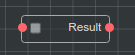

Modifier node.

Set output "Result" as logical NOT of input.

Equal (A === B)
~~~~~~~~~~~~~~~

.. image:: ../_static/nodes/boolean-eq.png
   :alt: boolean eq

Modifier node.

Set output "Result" as A === B

Numbers
-------

Equal (A === B)
~~~~~~~~~~~~~~~

.. image:: ../_static/nodes/number-eq.png
   :alt: number eq

Modifier node.

Set output "Result" as A === B

Is even
~~~~~~~

.. image:: ../_static/nodes/number-is-even.png
   :alt: number is even

Modifier node.

Set output "Result" to ``true`` if input number is even.

Greater or equal then
~~~~~~~~~~~~~~~~~~~~~

.. image:: ../_static/nodes/number-gte.png
   :alt: number is greater or equal then

Modifier node.

Set output "Result" to ``true`` if input A is greater then input B (or equal if boolean input is ``true``).

To String
~~~~~~~~~

.. image:: ../_static/nodes/number-to-string.png
   :alt: number to string

Modifier node.

Stringify input number.

Plus (A + B)
~~~~~~~~~~~~

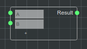

Modifier node with multiple inputs.

Set output "Result" as summ of inputs

Strings
-------

Append (A + B)
~~~~~~~~~~~~~~

.. image:: ../_static/nodes/string-append.png
   :alt: string append

Modifier node with multiple inputs.

Set output "Result" as united inputs.

Datetime
--------

.. note::

   **@bluepjs** uses ``dayjs`` (`website <https://day.js.org/>`_) library to manage date/time/datetime.

Create
~~~~~~

.. image:: ../_static/nodes/datetime-create.png
   :alt: datetime create

Modifier node.

Creates ``basic/datetime`` object using numbers input.

Unwrap
~~~~~~

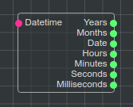

Modifier node.

Unwrap ``basic/datetime`` object into numbers.

To String
~~~~~~~~~

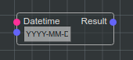

Modifier node.

Formats ``basic/datetime`` into string by format template.

.. note::

   Check `dayjs format docs <https://day.js.org/docs/en/display/format>`_.

Now
~~~

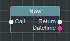

Executable node.

Created ``basic/datetime`` output with current datetime.

Undefined
---------

Is undefined
~~~~~~~~~~~~

.. image:: ../_static/nodes/undefined-is.png
   :alt: is undefined

Modifier node.

Set "Result" output to ``true`` if input is undefined.

.. note::

   javascript: ``typeof input === 'undefined'``

Branches and execution flow
---------------------------

For
~~~

.. image:: ../_static/nodes/flow-for.png
   :alt: for loop

Executable node.

For loop to iterate by 'from-to-step'

Each
~~~~

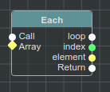

Executable node.

Each loop to iterate arrays.

If
~~

.. image:: ../_static/nodes/flow-if.png
   :alt: if/else node

Executable node.

If/else node.

Switch .. case
~~~~~~~~~~~~~~

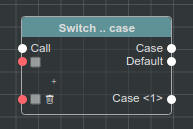

Executable node with multiple inputs/outputs.

Switch .. case node.

Call
~~~~

.. image:: ../_static/user-blueprint-call-node.png
   :alt: Call Node example

Executable node.

Autogenerated by IDE. Can't be added/removed manualy.

Return
~~~~~~

.. image:: ../_static/user-blueprint-return-node.png
   :alt: Return Node example

Executable node.

Can be added for **Functions** with outputs.

Wait
~~~~

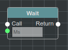

Executable node.

Pause execution flow for ms input.

Function
~~~~~~~~

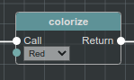

Dynamic executable node.

Autogenerated by IDE nodes for each available **Function**.

.. note::

   Colorize function described in extended integration example

Others
------

Console log
~~~~~~~~~~~

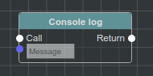

Executable node.

Prints message to **Vm** console.

Enums
-----

Enums nodes are autogenerated by IDE for each **enum**

Equal
~~~~~

.. image:: ../_static/nodes/enum-eq.png
   :alt: enum equal

Modifier node.

Check if inputs are same.

To String
~~~~~~~~~

.. image:: ../_static/nodes/enum-to-string.png
   :alt: enum to string

Modifier node.

Stringify input enum value.

Structs
-------

Structs nodes are autogenerated by IDE for each **struct**.

.. note::

   Struct on images described in extended integration example.

Pack
~~~~

.. image:: ../_static/nodes/struct-pack.png
   :alt: struct pack

Modifier node.

Creates **struct** by fields.

Unpack
~~~~~~

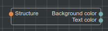

Modifier node.

Unpack **struct** by fields.

To Object
~~~~~~~~~

.. image:: ../_static/nodes/struct-to-object.png
   :alt: struct to object

Modifier node.

Convert type from struct type to ``basic/object`` (javascript object)

From Object
~~~~~~~~~~~

.. image:: ../_static/nodes/struct-from-object.png
   :alt: struct from object

Modifier node.

Convert type from ``basic/object`` (javascript object) to **struct** type.

Function inputs/outputs/variables, class properties
---------------------------------------------------

For any **Function** (simple function, event function, class constructor or method) there are autogenerated by IDE getters and setters **Nodes**.

Generating depends on variable context and access for class properties.

Get
~~~

Get **Function** variable:

.. image:: ../_static/nodes/get-variable.png
   :alt: get function variable

Get **Class** property:

.. image:: ../_static/nodes/get-property.png
   :alt: get class property

Getter node.

Get required variable/property. For **Classes** takes object of class to modify.

Set
~~~

Set **Function** variable:

.. image:: ../_static/nodes/set-variable.png
   :alt: set function variable

Set **Class** property:

.. image:: ../_static/nodes/set-property.png
   :alt: set class property

Executable node.

Set required variable/property. For **Classes** takes object of class to modify.

Classes
-------

Classes **Nodes** are autogenerated by **Classes** and **Actors**.

This
~~~~

.. image:: ../_static/nodes/class-this.png
   :alt: class this

Getter node.

Exists only in **Class** methods and constructor blueprints. Returns "this" pointer of object.

Cast to
~~~~~~~

.. image:: ../_static/nodes/class-cast-to.png
   :alt: class this

Modifier node.

Exists only when some **Classes** **Inheritance** is found. Convers object type from parent type to child type.

New
~~~

.. image:: ../_static/nodes/class-new.png
   :alt: class new

Executalbe dynamic node.

Exists only when some **Classes** exists. Creates new object of class. **Node** inputs are autogenerated by selected constructor inputs.

Constructor
~~~~~~~~~~~

.. image:: ../_static/nodes/class-constructor.png
   :alt: class constructor

Executalbe dynamic node.

Exists only when some **Classes** **Inheritance** exists in child classes constructors. Allows call (or not) parent class constructors.

.. note::

   Example image demostractes "Demo class 2" constructor. "Demo class 2" defined as extends from "Demo Class 1".

Method
~~~~~~

.. image:: ../_static/nodes/class-method.png
   :alt: class method

Executalbe dynamic node.

Autogenerated by IDE for **Classes**/**Actors** methods with accesibility checking (public/protected/private/...). Takes object to use as input.

.. note::

   Colorize function described in extended integration example
