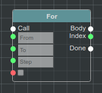

Default Nodes/Узлы по умолчанию
===============================

**@bluepjs** роставляется с набором **Nodes/Узлов** по умолчанию. Новые **Nodes/Узлы** могут быть добавлены **Developers/Разработчиками**

.. note::

   Текущий список **Nodes/Узлов** невелик, потому что был разработан "on demand/по требованию" и не содержит всех основных операций с различными типами.

   Новые **Nodes/Узлы** будут обновлены в следующих версиях.

Booleans/Логические значения(Булевы)
------------------------------------

And/И (A && B)
~~~~~~~~~~~~

.. image:: ../_static/nodes/boolean-and-or.png
   :alt: boolean and

Узел-модификатор с несколькими входами.

Устанавливает выход "Result/Результат" как логическое AND/И из входов.

Or/ИЛИ (A || B)
~~~~~~~~~~~

.. image:: ../_static/nodes/boolean-and-or.png
   :alt: boolean or

Узел-модификатор с несколькими входами.

Устанавливает выход "Result/Результат" как логическое OR/ИЛИ из входов.

Not/Нет (!A)
~~~~~~~~

.. image:: ../_static/nodes/boolean-not.png
   :alt: boolean not

Узел-модификатор.

Устанавливает выход "Result/Результат" как логическое NOT/НЕТ из входов.

Equal/Равно (A === B)
~~~~~~~~~~~~~~~~~~~~~


Узел-модификатор.

Устанавливает выход "Result/Результат" как A === B

Numbers/Числа
-------------

Equal/Равно (A === B)
~~~~~~~~~~~~~~~~~~~~~

.. image:: ../_static/nodes/number-eq.png
   :alt: number eq

Узел-модификатор.

Устанавливает выход "Result/Результат" как A === B

Is even/является четным
~~~~~~~~~~~~~~~~~~~~~~~

.. image:: ../_static/nodes/number-is-even.png
   :alt: number is even

Узел-модификатор.

Устанавливает выход "Result/Результат" в ``true``, если входное число четное.

Greater or equal then/Больше или равно тогда
~~~~~~~~~~~~~~~~~~~~~~~~~~~~~~~~~~~~~~~~~~~~


Узел-модификатор.

Устанавливает выход "Result/Результат" в ``true``, если вход A больше входа B (или равен, если логический ввод равен ``true``).

To String/К строке
~~~~~~~~~~~~~~~~~~


Узел-модификатор.

Переводит к номеру строки.

Plus/Плюс (A + B)
~~~~~~~~~~~~~~~~~

.. image:: ../_static/nodes/number-plus.png
   :alt: number plus

Узел-модификатор с несколькими входами.

Устанавливает выход "Result/Результат" как сумма входных данных.

Strings/Строки
--------------

Append/Добавление (A + B)
~~~~~~~~~~~~~~~~~~~~~~~~~


Узел-модификатор с несколькими входами.

Устанавливает выход "Result/Результат" как объединение входных данных.

Datetime/Дата и время
---------------------

.. note::

   **@bluepjs** использует библиотеку ``dayjs`` (`website <https://day.js.org/>`_) для управления датой/временем/временем суток.

Create/Создать
~~~~~~~~~~~~~~

.. image:: ../_static/nodes/datetime-create.png
   :alt: datetime create

Узел-модификатор.

Создает объект ``basic/datetime``, используя ввод чисел.

Unwrap/Развернуть
~~~~~~~~~~~~~~~~~

.. image:: ../_static/nodes/datetime-unwrap.png
   :alt: datetime unwrap

Узел-модификатор.

Разворачивает объект ``basic/datetime`` в числа.

To String/К строке
~~~~~~~~~~~~~~~~~~

.. image:: ../_static/nodes/datetime-to-string.png
   :alt: datetime to string

Узел-модификатор.

Форматирует ``basic/datetime`` в строку по шаблону формата.

.. note::

   Проверьте ``документацию по форматам`` `dayjs <https://day.js.org/docs/en/display/format>`_.

Now/Сейчас
~~~~~~~~~~

.. image:: ../_static/nodes/datetime-now.png
   :alt: datetime now

Исполняемый узел.

Создает выход ``basic/datetime`` с текущими датой/временем.

Undefined/Неопределено
----------------------

Is undefined/Является неопределенным
~~~~~~~~~~~~~~~~~~~~~~~~~~~~~~~~~~~~

.. image:: ../_static/nodes/undefined-is.png
   :alt: is undefined

Узел-модификатор.

Устанавливает выход "Result/Результат" в ``true```, если входные данные не определены.

.. note::

   javascript: ``typeof input === 'undefined'``

Branches and execution flow/Ветви и поток выполнения
----------------------------------------------------

For/Для
~~~~~~~



Исполняемый узел.

Для цикла итерации 'from-to-step/от шага к шагу'

Each/Каждый
~~~~~~~~~~~

.. image:: ../_static/nodes/flow-each.png
   :alt: each loop

Исполняемый узел.

Каждый цикл для итерации массивов.

If/Если
~~~~~~~

.. image:: ../_static/nodes/flow-if.png
   :alt: if/else node

Исполняемый узел.

Узел If(если)/else(кроме).

Switch .. case
~~~~~~~~~~~~~~

.. image:: ../_static/nodes/flow-switch.png
   :alt: switch .. case

Исполняемый узел с несколькими входами/выходами.

Switch .. case node.

Call/Вызов
~~~~~~~~~~

.. image:: ../_static/user-blueprint-call-node.png
   :alt: Call Node example

Исполняемый узел.

Автогенерируется IDE. Не может быть добавлен/удален вручную.

Return/Возврат
~~~~~~~~~~~~~~


Исполняемый узел.

Может быть добавлен для **функций** с выходами.

Wait/Ждать
~~~~~~~~~~

.. image:: ../_static/nodes/flow-wait.png
   :alt: wait

Исполняемый узел.

Приостанавливает выполнение потока для получения ms input/мс входы.

Function/Функция
~~~~~~~~~~~~~~~~

.. image:: ../_static/nodes/flow-function.png
   :alt: function example

Динамический исполняемый узел.

Автогенерируется узлами IDE для каждой доступной **функции**.

.. note::

   Функция Colorize/раскрашивания, описанная в расширенном примере интеграции

Others/Другие
-------------

Console log/Журнал консоли
~~~~~~~~~~~~~~~~~~~~~~~~~~

.. image:: ../_static/nodes/console-log.png
   :alt: console log

Исполняемый узел.

Выводит сообщение на консоль **виртуальной машины**.

Enums/Перечисления
------------------

Узлы Enums автоматически генерируются IDE для каждого **enum**

Equal/Равно
~~~~~~~~~~~

.. image:: ../_static/nodes/enum-eq.png
   :alt: enum equal

Узел-модификатор.

Проверяет, одинаковы ли входы.

To String/К строке
~~~~~~~~~~~~~~~~~~


Узел-модификатор.

Строковое значение входного перечисления.

Structs/Структуры
-----------------

Узлы Structs автоматически генерируются IDE для каждой **структуры**.

.. note::

   Структуры на изображениях описаны в примере расширенной интеграции.

Pack/Пакет
~~~~~~~~~~

.. image:: ../_static/nodes/struct-pack.png
   :alt: struct pack

Узел-модификатор.

Создает **структуру** по полям.

Unpack/Распаковать
~~~~~~~~~~~~~~~~~~

.. image:: ../_static/nodes/struct-unpack.png
   :alt: struct unpack

Узел-модификатор.

Распаковывает **структуру** по полям.

To Object/К объекту
~~~~~~~~~~~~~~~~~~~

.. image:: ../_static/nodes/struct-to-object.png
   :alt: struct to object

Узел-модификатор.

Преобразование типа из struct типа в ``basic/object`` (javascript object)

From Object/Из объекта
~~~~~~~~~~~~~~~~~~~~~~

.. image:: ../_static/nodes/struct-from-object.png
   :alt: struct from object

Узел-модификатор.

Преобразует тип из ``basic/object`` (javascript object) в тип **struct**.

Function inputs/outputs/variables, class properties/Входы/выходы функций/переменные, свойства класса
----------------------------------------------------------------------------------------------------

Для любой **Function/функции** (простой функции, функции события, конструктора класса или метода) существуют автогенерируемые IDE геттеры и сеттеры **Nodes/узлов**.

Генерация зависит от контекста переменной и доступа к свойствам класса.

Get/Получить
~~~~~~~~~~~~

Получить переменную **Function/функция**:

.. image:: ../_static/nodes/get-variable.png
   :alt: get function variable

Получить **Class/Класс** свойство:

.. image:: ../_static/nodes/get-property.png
   :alt: get class property

Геттерный узел.

Получает требуемую переменную/свойство. Для **Classes/классов** принимает объект класса для изменения.

Set/Установить
~~~~~~~~~~~~~~

Установить переменную **Function/функция**:


Установить свойство **Class/класс**:

.. image:: ../_static/nodes/set-property.png
   :alt: set class property

Исполняемый узел.

Устанавливает необходимую переменную/свойство. Для **Classes/классов** ринимает объект класса для изменения.

Classes/Классы
--------------

Классы **Nodes/узлов** автогенерируются **Classes/классами** и **Actors/акторами**.

This/Этот
~~~~~~~~~


Узел-получатель.

Существует только в методах **Class/класс** и чертежах конструктора. Возвращает "this" указатель на объект.

Cast to/Приводится к
~~~~~~~~~~~~~~~~~~~~


Узел-модификатор.

Существует только при наличии некоторых **Classes/классов** **Inheritance/наследования**. Преобразует тип объекта от родительского типа к дочернему.

New/Новый
~~~~~~~~~


Выполняемый динамический узел.

Существует только при наличии некоторых **Classes/классов**. Создает новый объект класса. Входы **Node/узла** автоматически генерируются выбранными входами конструктора.

Constructor/Конструктор
~~~~~~~~~~~~~~~~~~~~~~~

.. image:: ../_static/nodes/class-constructor.png
   :alt: class constructor

Выполняемый динамический узел.

Существует только при наличии некоторых **Classes/классов** **Inheritance/наследования**  в конструкторах дочерних классов. Allows call (or not) parent class constructors.

.. note::

   Пример изображения демонстрирует конструктор "Demo class 2". "Demo class 2" определен как расширение от "Demo Class 1".

Method/Метод
~~~~~~~~~~~~


Выполняемый динамический узел.

Автогенерируется IDE для методов **Classes**/**Actors** с проверкой доступности (public/protected/private/...). Принимает объект для использования в качестве входных данных.

.. note::

   Функция Colorize/раскрашивания описана в расширенном примере интеграции
